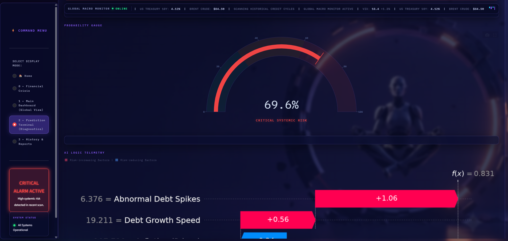

# ⚡ Systemic Macroeconomic Early Warning System (EWS)

A production-grade, interactive financial telemetry dashboard and machine learning early warning system designed to detect systemic macroeconomic risks across global economies.

---

## 🚀 System Architecture & Key Features

- **Advanced Signal Processing:** Integrates historical datasets (such as the Jordà-Schularick-Taylor Macrohistory Database) processed via Hodrick-Prescott filters to strip out noise and isolate structural imbalances.
- **Cost-Sensitive Machine Learning:** Powered by **XGBoost** utilizing custom class weighting (`scale_pos_weight`) to overcome extreme class imbalance and aggressively penalize missed crisis events. Evaluated using **PR-AUC** rather than misleading baseline accuracy metrics.
- **Explainable AI (XAI):** Features transparent, custom-styled **TreeSHAP** waterfall charts embedded directly into the UI to break down feature contributions and eliminate the economic "black-box" problem.
- **Real-Time Market Telemetry:** Dynamically streams live global market data (VIX, 10-Year US Treasury Yields, Brent Crude Oil, and FX rates) via the **Yahoo Finance API (`yfinance`)**.
- **Interactive HUD Interface:** Built using **Streamlit**, featuring high-contrast tactical design elements, global risk heatmaps, interactive threat matrices with callback routing, and scenario stress-testing tools.

---

## 🛠️ Project Structure

```text
├── 01_Raw_Data.ipynb             # Raw JST macrohistory data ingestion
├── 02_Preprocessing.ipynb         # Signal processing & Hodrick-Prescott filtering
├── 03_Algorithm_Training.ipynb   # XGBoost training, cost-tuning & PR-AUC evaluation
├── 04_Explainable_AI.ipynb       # SHAP value extraction & interpretability logic
├── app.py                         # Main Streamlit application entry point & routing
├── backend.py                     # Data pipelines, ML predictions & Yahoo Finance API
├── frontend.py                    # HUD custom CSS, charts, and interactive UI views
└── requirements.txt               # Project dependencies
```

---

## ⚙️ Installation & Execution

### 1. Clone the Repository

Clone the repository and navigate to the project directory:

```bash
git clone https://github.com/Sanju-1001011/financial-crisis-predictor.git
cd financial-crisis-predictor
```

### 2. Install the Required Dependencies

```bash
pip install -r requirements.txt
```

### 3. Launch the Streamlit Application

```bash
streamlit run app.py
```

Or:

```bash
python -m streamlit run app.py
```

### 4. If You Encounter an Error

Install the requirements again:

```bash
pip install -r requirements.txt
```

If `yfinance` is missing:

```bash
pip install yfinance
```

Then launch the application again:

```bash
streamlit run app.py
```

Or:

```bash
python -m streamlit run app.py
```

---

## 📸 Project Screenshots

### Financial Crisis Predictor


### Prediction



### Prediction Terminal


---

## 🚀 Project Status

The project is fully documented and ready for deployment, demonstration, and further development.
